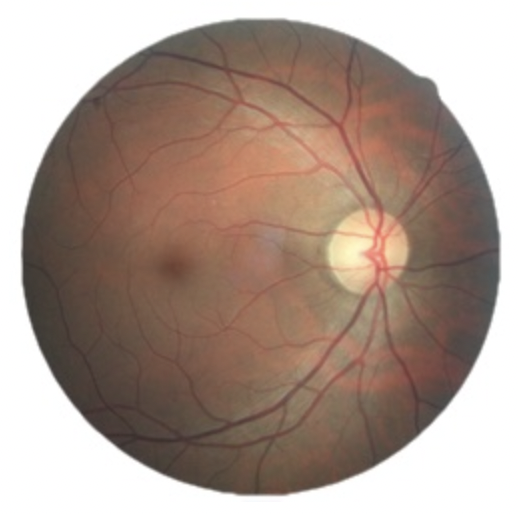

# Diabetic_Retinopathy_Classification_Assignment

- Group project of 4 members
- Diabetic Retinopathy classification (image-based)
- Data was based on the Kaggle competition (https://www.kaggle.com/c/diabetic-retinopathy-detection)

  

- I worked on the SVM model, and my work was done in svm_drc.ipynb
- Our best model was the SVM model, with performance  :
    - Train accuracy  : 93.7%
    - Test accuracy   : 73.6%

 
- Our group has written a paper based on our study and more information can be read there in DRC_report.pdf

